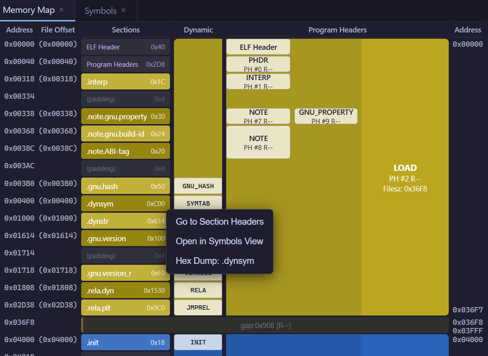

# ELF Viewer

A viewer for exploring ELF binary structure, providing information equivalent to `readelf`.

- **Desktop app (Wails)**: GUI application that opens ELF files via a native file dialog
- **Web app (browser)**: Client-side web application that opens files via `<input type="file">`

Both modes run the same TypeScript ELF parser entirely on the client side.

## Features

- **Graphical memory map** — visualizes segment and section layout; click any region to navigate to the corresponding section or program header entry
- **Works without section headers** — falls back to program headers and the dynamic segment to display symbol tables, relocations, and dynamic entries
- **ELF32 and ELF64, little-endian and big-endian** — broad architecture coverage
- **Web version runs entirely in the browser** — no installation or server required; files are processed locally and never uploaded



## Usage

### Web app

No installation required. Open the web app in your browser:

**[https://kariya-mitsuru.github.io/elf-viewer/](https://kariya-mitsuru.github.io/elf-viewer/)**

Alternatively, download the standalone HTML file (e.g. `elf-viewer-v0.1.3.html`) from the [Releases page](https://github.com/kariya-mitsuru/elf-viewer/releases) and open it directly in your browser — no server needed.

### Desktop app

Download the latest Linux binary from the [Releases page](https://github.com/kariya-mitsuru/elf-viewer/releases) using `curl`:

```sh
VERSION=x.y.z  # replace with the actual version
# amd64
curl -L -o elf-viewer "https://github.com/kariya-mitsuru/elf-viewer/releases/download/v${VERSION}/elf-viewer-v${VERSION}-linux-amd64"
# arm64
curl -L -o elf-viewer "https://github.com/kariya-mitsuru/elf-viewer/releases/download/v${VERSION}/elf-viewer-v${VERSION}-linux-arm64"
```

```sh
chmod +x elf-viewer
./elf-viewer /path/to/binary
```

---

## Limitations

- Symbol demangling is not supported — C++ mangled names are displayed as-is
- DWARF and other debug information is not parsed
- Archive files (`.a`) are not supported
- Compressed sections (`SHF_COMPRESSED`) are not supported

---

## Runtime Requirements

### Desktop app (Wails)

The built binary links against the following system libraries:

- `libgtk-3-0`
- `libwebkit2gtk-4.0-0` (Ubuntu < 24.04) or `libwebkit2gtk-4.1-0` (Ubuntu 24.04+ / Debian bookworm+)

These are typically pre-installed on desktop Linux systems. If not:

```sh
# Ubuntu / Debian (< 24.04)
sudo apt install libgtk-3-0 libwebkit2gtk-4.0-0
# Ubuntu 24.04+ / Debian bookworm+
sudo apt install libgtk-3-0 libwebkit2gtk-4.1-0
```

### Web app

No runtime requirements beyond a web browser.

---

## Build Requirements

### Desktop app (Wails)

- Go 1.25 or later
- Node.js 24 or later (with npm)
- Wails CLI v2
- System libraries: `build-essential`, `libgtk-3-dev`, and `libwebkit2gtk-4.0-dev` (or `libwebkit2gtk-4.1-dev` on Ubuntu 24.04+ / Debian bookworm+)

```sh
go install github.com/wailsapp/wails/v2/cmd/wails@latest
```

```sh
# Ubuntu / Debian (< 24.04)
sudo apt install build-essential libgtk-3-dev libwebkit2gtk-4.0-dev
# Ubuntu 24.04+ / Debian bookworm+
sudo apt install build-essential libgtk-3-dev libwebkit2gtk-4.1-dev
```

### Web app (browser only)

- Node.js 24 or later (with npm)

---

## Building

Use `make` for common tasks (`make help` lists all targets).
On Ubuntu 24.04+ / Debian bookworm+, the `-tags webkit2_41` flag is automatically applied via `pkg-config`.

```sh
make build            # Build the Wails desktop app
make dev              # Start dev mode with hot reload
make dev FILE=/usr/bin/ls  # Start dev mode with a file pre-loaded
make web              # Build the browser web app (output: frontend/dist/)
make web-dev          # Start the browser web dev server
make web-preview      # Preview the browser web build
make generate         # Regenerate wailsjs bindings after changing app.go
make lint             # Run ESLint
make fmt              # Format source files with Prettier
make release VERSION=x.y.z  # Trigger the GitHub Actions release workflow
```

### Desktop app — production build

```sh
make build
```

Output: `build/bin/elf-viewer`

You can pass an ELF file path as a command-line argument:

```sh
./build/bin/elf-viewer /usr/bin/ls
```

### Desktop app — dev mode

Starts with hot reload. Changes to both Go and TypeScript are reflected immediately.

```sh
make dev                       # hot reload
make dev FILE=/usr/bin/ls      # with a file pre-loaded at startup
```

### Web app — production build

```sh
make web    # output goes to frontend/dist/
```

Serve the generated `frontend/dist/` directory from any static file server.
To preview locally:

```sh
make web-preview  # http://localhost:4173
```

### Web app — dev server

```sh
make web-dev  # http://localhost:5173
```

---

## Version & Release

To release a new version, run `make release VERSION=x.y.z` from the `dev` branch (or any non-main branch).

`make release` bumps the version in `frontend/package.json`, commits the change, pushes the branch, and opens a pull request to `main`. The pull request is automatically approved and merged once all CI checks pass. When the merge lands on `main`, a `v*.*.*` tag is created automatically, which triggers the release workflow to build Linux binaries (amd64 and arm64) and publish a GitHub Release.

---

## Source files

### Tracked (source files)

```
app.go                        # Go backend (OpenFileDialog, ReadFileBytes, etc.)
main.go                       # Wails entry point + Go embed
go.mod / go.sum               # Go module definition and lock
wails.json                    # Wails project configuration
Makefile

frontend/index.html           # HTML entry point
frontend/style.css
frontend/package.json
frontend/package-lock.json
frontend/tsconfig.json
frontend/vite.config.ts
frontend/eslint.config.js
frontend/.prettierrc
frontend/src/                 # TypeScript source
frontend/wailsjs/             # Auto-generated Wails bindings (Go API type definitions)
```

`frontend/wailsjs/` is generated by `wails generate module`, but is tracked because it is required for TypeScript builds and editor type checking. Regenerate it whenever the public methods in `app.go` change:

```sh
make generate
# or: wails generate module
```

### Not tracked (generated / environment-specific)

```
build/                        # wails build output (binaries)
frontend/dist/                # npm run build output
frontend/node_modules/        # npm dependencies
frontend/package.json.md5     # Wails internal checksum file
frontend/.vite/               # Vite dependency pre-bundling cache
```

---

## Directory structure

```
.
├── app.go                    # Wails backend (OpenFileDialog, ReadFileBytes, etc.)
├── main.go                   # Wails entry point + Go embed
├── go.mod / go.sum
├── wails.json
├── Makefile
└── frontend/
    ├── index.html
    ├── style.css
    ├── package.json
    ├── tsconfig.json
    ├── vite.config.ts
    ├── eslint.config.js
    ├── .prettierrc
    ├── src/
    │   ├── main.ts           # Entry point
    │   ├── app.ts            # Application controller (sidebar, tabs)
    │   ├── parser/
    │   │   ├── types.ts      # ELF type definitions
    │   │   ├── reader.ts     # Binary read utilities
    │   │   ├── elf.ts        # ELF parser (DataView-based, ELF32/64, LSB/MSB)
    │   │   └── elf.test.ts   # Parser unit tests
    │   ├── views/
    │   │   ├── ElfHeaderView.ts
    │   │   ├── ProgramHeadersView.ts
    │   │   ├── SectionHeadersView.ts
    │   │   ├── SymbolsView.ts
    │   │   ├── RelocationsView.ts
    │   │   ├── DynamicView.ts
    │   │   ├── NotesView.ts
    │   │   ├── HashView.ts           # SHT_HASH view
    │   │   ├── GnuHashView.ts        # SHT_GNU_HASH view
    │   │   ├── VersionsView.ts       # GNU version info view
    │   │   ├── HexDumpView.ts        # Section hex dump view
    │   │   ├── MemoryMapView.ts
    │   │   ├── layout.ts             # ELFFile → MemoryMapView intermediate representation
    │   │   ├── viewUtils.ts          # Shared view utilities
    │   │   └── virtualScroll.ts      # Virtual scrolling for large tables
    │   ├── ui/
    │   │   ├── TabManager.ts
    │   │   ├── Sidebar.ts
    │   │   ├── SectionNav.ts         # In-view section navigation
    │   │   ├── AboutDialog.ts
    │   │   └── ContextMenu.ts
    │   └── platform/
    │       ├── wails.ts              # File loading via Wails
    │       └── web.ts                # File loading via FileReader
    └── wailsjs/                      # Generated by wails generate module
        ├── go/main/App.js
        ├── go/main/App.d.ts
        └── runtime/
```

---

## License

`SPDX-License-Identifier: MIT`

Copyright (c) 2026 Mitsuru Kariya. See [LICENSE](LICENSE) for details.
